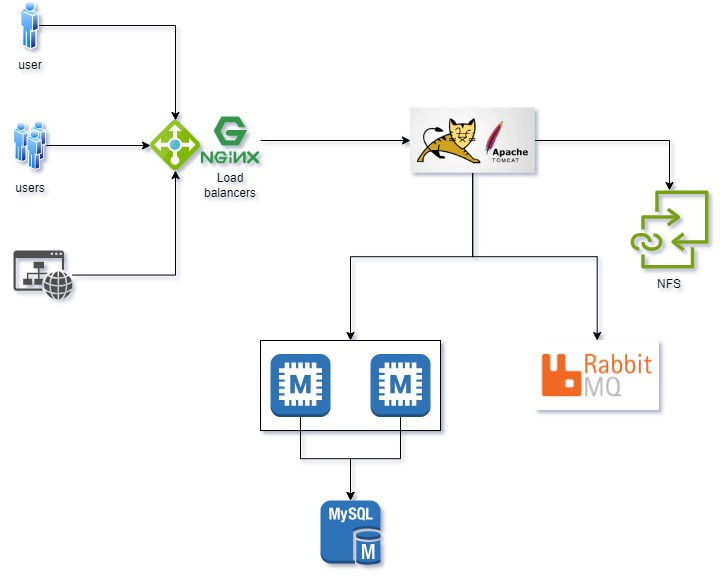

# Project Architecture

# Versions of the technologies
- JDK 11 
- Maven 3 
- MySQL 8

# Services used
- Spring MVC
- Spring Security
- Spring Data JPA
- Maven
- JSP
- Tomcat
- MySQL
- Memcached
- Rabbitmq
- ElasticSearch
- Nginx

# Order for manual provisioning using vagrant
1. MySQL (Database SVC)
2. Memcached (DB Caching SVC)
3. RabbitMQ (Broker/Queue SVC)
4. Apache Tomcat (Application SVC)
5. Nginx (Web SVC)
